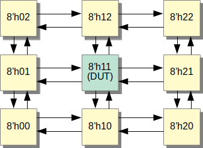

# Hermes Network-on-Chip Router Testbench

The DUT is the NoC router presented in the paper [HERMES: an infrastructure for low area overhead packet-switching networks on chip](https://www.sciencedirect.com/science/article/pii/S0167926004000185). The DUT is the central router illustrated in Fig below, with an 8 bit network address set in design time, five master ports for incomming packets, five slave ports for outgoing packets. Although only the central router is simulated, it mimics the existence of a 3x3 NoC used only for routing address purposes. 



This UVM-based router TB is a more advanced TB, compared to the previous ones, with multiple agents, each one attached to a different router port. It has several different types of randomization and constraints to generate valid packet headers and to randomize the time the packets and the flits are injected into the router. It uses virtual and hierarchical sequences to coordinate various sequences in parallel. It has a scoreboard, and different coverage points/crosses. config_db is used to to distribute parameters to the environment and to 10 agents (5 slaves and 5 master agents). The agent (slave or master) is configured with factory overrride, changing the behavior of the driver. config_db is also used to pass parameters from tests to sequences. 

## The Testbench Architecture

This router TB is organized in three main modules:
 - [**hermes_router**](../): the router design where the RTL, netlist, top, simulation scripts, tests and sequences are located;
 - [**hermes_pkg**](../../vips/hermes_pkg): contains the protocol dependent part of the testbench, i.e. the agent, both slave/master drivers, the monitor, interface, agent configuration class, and main design parameters;
 - [**hermes_router_env_pkg**](../../vips/hermes_router_env_pkg): contains the router environment, which instantiates 5 slave and 5 master agents. It also contains the coverage module, the scoreboard, and the environment configuration class.

## Running the Tests

> git clone https://github.com/amamory/uvm-basics.git
> cd uvm-basics/noc-router/hermes_router/sim
> vsim -c -do run.do

## The Testbench Knobs

The [run.do](../sim/run.do) file has few parameter to change the type of simulation.

```
set SEED      "random"
set VERBOSITY "UVM_HIGH"
# set true to enable coverage
set COVERAGE  "true"      
# set true to simulate RTL, otherwise, simulates the netlist
set RTL_SIM   "true"
# set true to simulate for debug, therwise simulate for speed/regression
set DEBUG_SIM "true" 
```

## Existing Tests

There are 3 types of configurations: environment ([hermes_router_env_config](../../vips/hermes_router_env_pkg/src/hermes_router_env_config.sv)), agent ([hermes_agent_config](../../vips/hermes_pkg/src/hermes_agent_config.sv)), and sequence ([hermes_router_seq_config](../tb/seqs/src/hermes_router_seq_config.sv)) configurations. Each test in *build_phase* must set the environment and the agent configuration accordinly. There is only  one environment configuration and five agent configurations, where one agent configuration is set to each port direction (N, S, W, E, Local). The Sequence configuration is set in *run_phase* , this configuration is sent to its sequencer, and the seqeunce is started. Check the [repeat_test](../tb/tests/src/repeat_test.sv) for an example.

## Creating New Tests

The easiest way is to derive new tests based on the existing ones. Then, just tweak the configuration knobs according to the goal of this new test. See the tests available [here](../tb/tests/src).

## Stuff to be done

This router TB is functional but there are more features I want to implement, in order of importance, such as:
 - Document the TB architecture, tests, sequences, checks, and converage. Perhaps using Markdown and ReadTheDocs.
 - Set tests with plusargs, making the tests more configurable without recompilation and also reducing the number of tests 
 - Include SV assertions in the DUT
 - Design a Power Aware Simulation using Unified Power Format (UPF)
 - Describe sequences for error injection
 - Include a fault injection method with UVM and/or using formal methods, such as 
[How Formal Reduces Fault Analysis for ISO 26262](https://www.mentor.com/products/fv/resources/overview/how-formal-reduces-fault-analysis-for-iso-26262-82758134-85e7-4753-92f4-6f90e36e7d96)
 - More open-ended task would be to keep studying SV and UVM usage methods to improve the reuse for this testbench.
